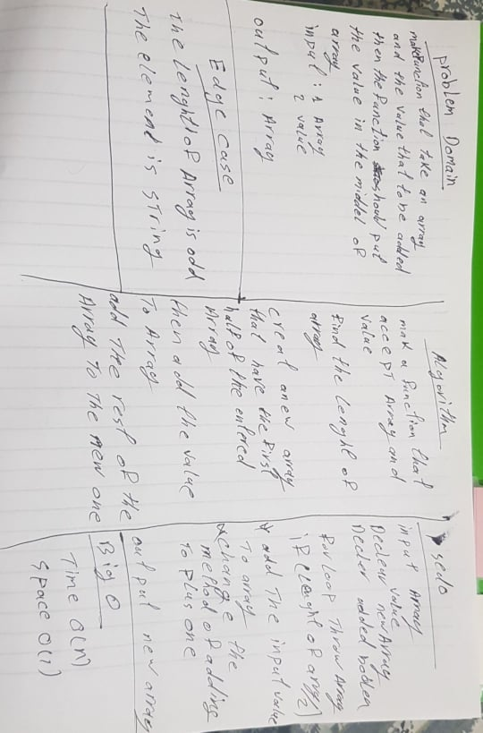

# Challenge Summary

function take array and value and return with vaule in the middle

## Challenge Description

it is a function called insertShiftArray which takes in an array and the value to be added. Without utilizing any of the built-in methods available in language, and it is return an array with the new value added at the middle index.

## Approach & Efficiency

for loop that will restor the array element and when it reach to the middle put the value and the rest of array

the big o of this function is o(n) since it will deppend on the lenght of the array

## Solution

