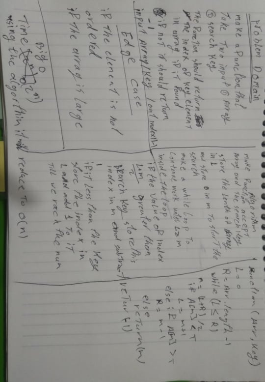

# Challenge Summary

function take array and key then return the index of that key if it in arry if not return -1

## Challenge Description

 a function called BinarySearch which takes in 2 parameters: a sorted array and the search key. Without utilizing any of the built-in methods available in language, it return the index of the array’s element that is equal to the search key, or -1 if the element does not exist.

## Approach & Efficiency

binary algorethem that reduce the search half every time it loop

if we use normal search it the big o is 0 (2^n) but since we used binary search it will become o (n)

## Solution

