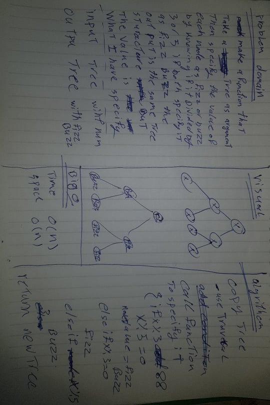

# Challenge Summary

make function take tree and return new tree with fuzz buzz

## Challenge Description

Write a function called FizzBuzzTree which takes a tree as an argument.
Without utilizing any of the built-in methods available to your language, determine whether or not the value of each node is divisible by 3, 5 or both. Create a new tree with the same structure as the original, but the values modified as follows:
If the value is divisible by 3, replace the value with “Fizz”
If the value is divisible by 5, replace the value with “Buzz”
If the value is divisible by 3 and 5, replace the value with “FizzBuzz”
If the value is not divisible by 3 or 5, simply turn the number into a String.

## Approach & Efficiency

use traversal method with fizzbuzz specifier to get new tree with fizz buzz values 

efficiency it take o(n) of time so and the fizzbuzz specifier is very efficient 

## Solution

