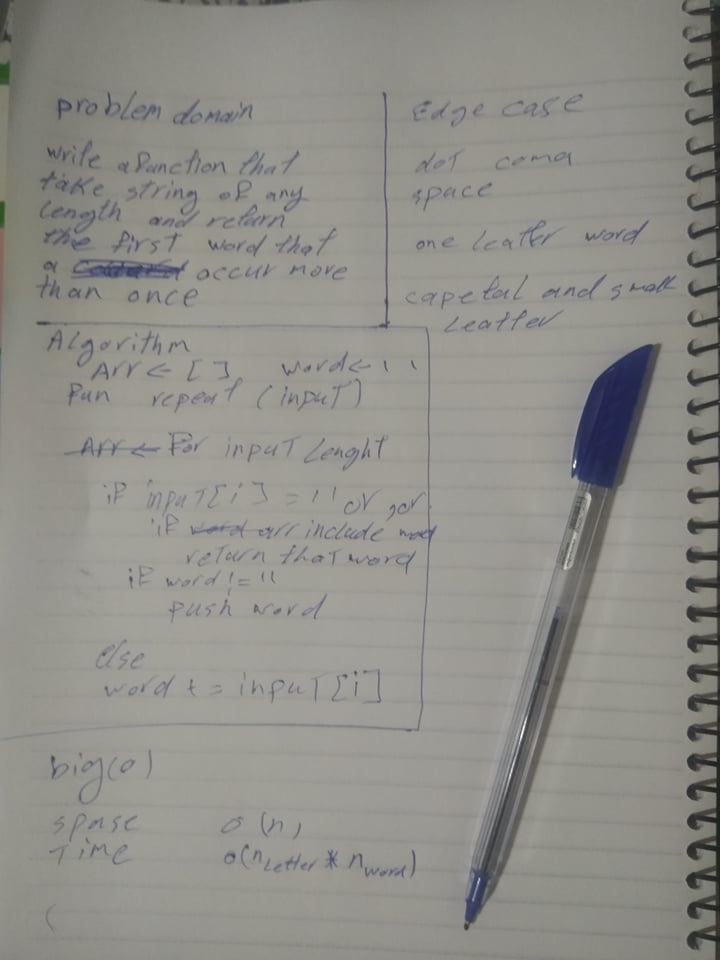

# Challenge Summary

Write a function that accepts a lengthy string parameter and return the first word to occur more than once in that provided string.

## Challenge Description

Write a function that accepts a lengthy string parameter and return the first word to occur more than once in that provided string.

## Approach & Efficiency

i take the string then separate the word by space or dot or comma then check if it listed in my array if not push that word to array

## Solution

