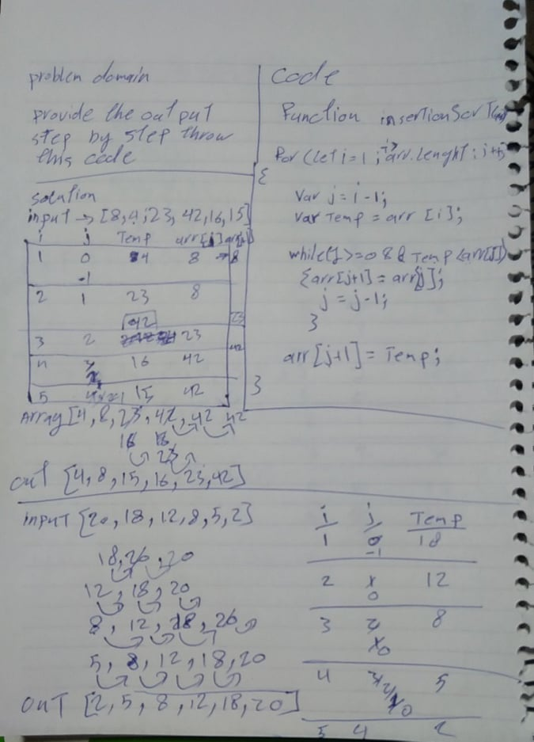
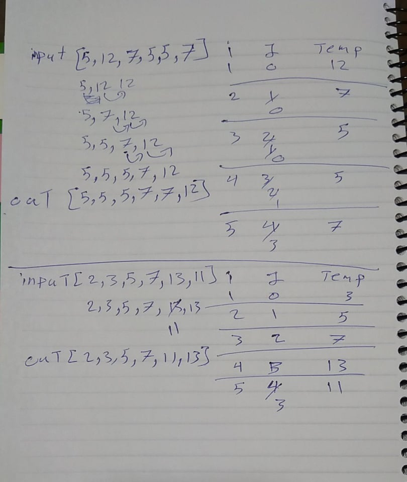

# Challenge Summary

trace the algorithm by stepping through the process with the provided sample array. Document your explanation by creating a blog article that shows the step-by-step output after each iteration through some sort of visual.

## Challenge Description

function that sort the input array 

## Approach & Efficiency

trace the algorithm by stepping through the process with the provided sample array.
show that i am understanding how the process goes in the function

## Solution

