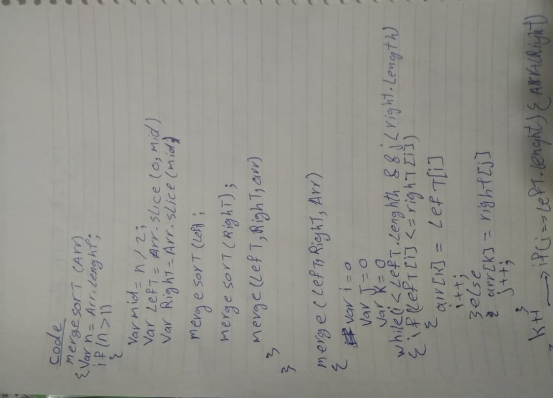
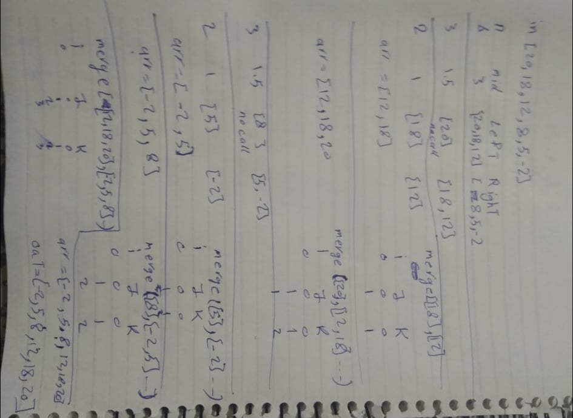
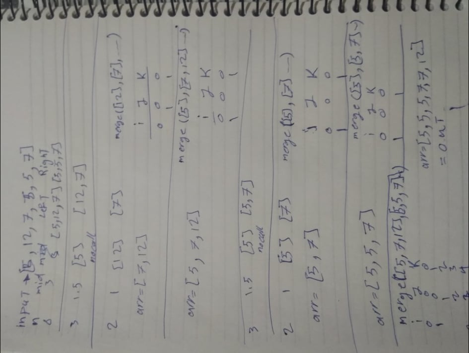
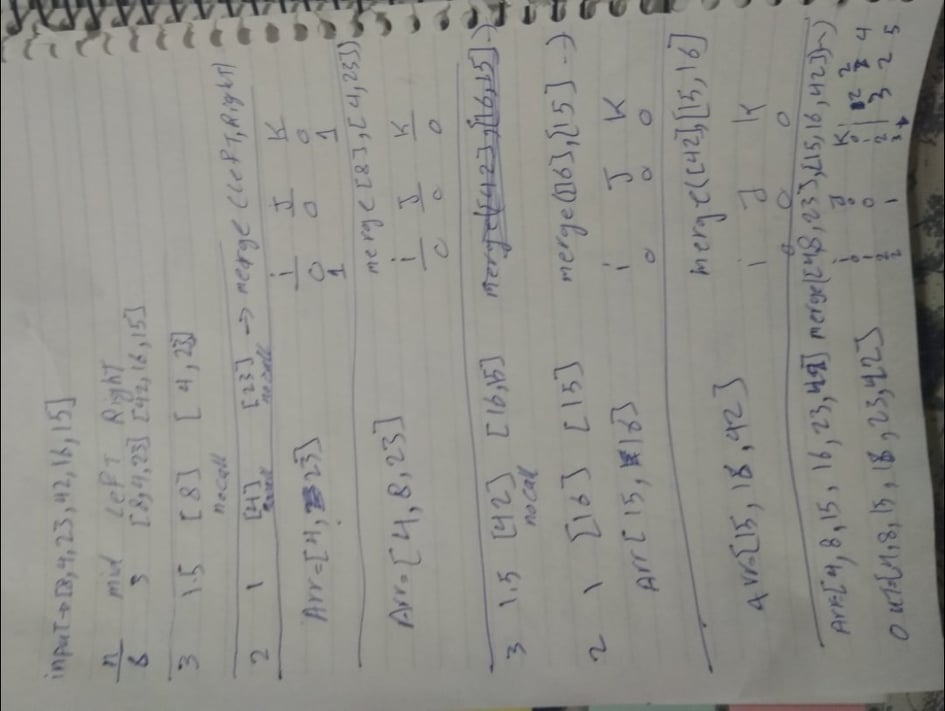

# Challenge Summary

trace the algorithm by stepping through the process with the provided sample array. Document your explanation by creating a blog article that shows the step-by-step output after each iteration through some sort of visual.

## Challenge Description

function that sort the input array merge sort

## Approach & Efficiency

trace the algorithm by stepping through the process with the provided sample array.
show that i am understanding how the process goes in the function

this algorithm works by dividing the array by the half every time till it reach to arr of length 2 then sor the element on it and comber it with it other half and so on till it finish all the array  

## Solution

whiteboard :

