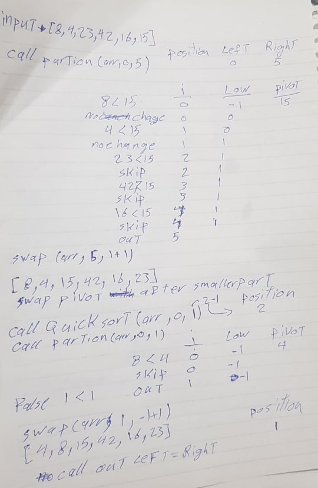
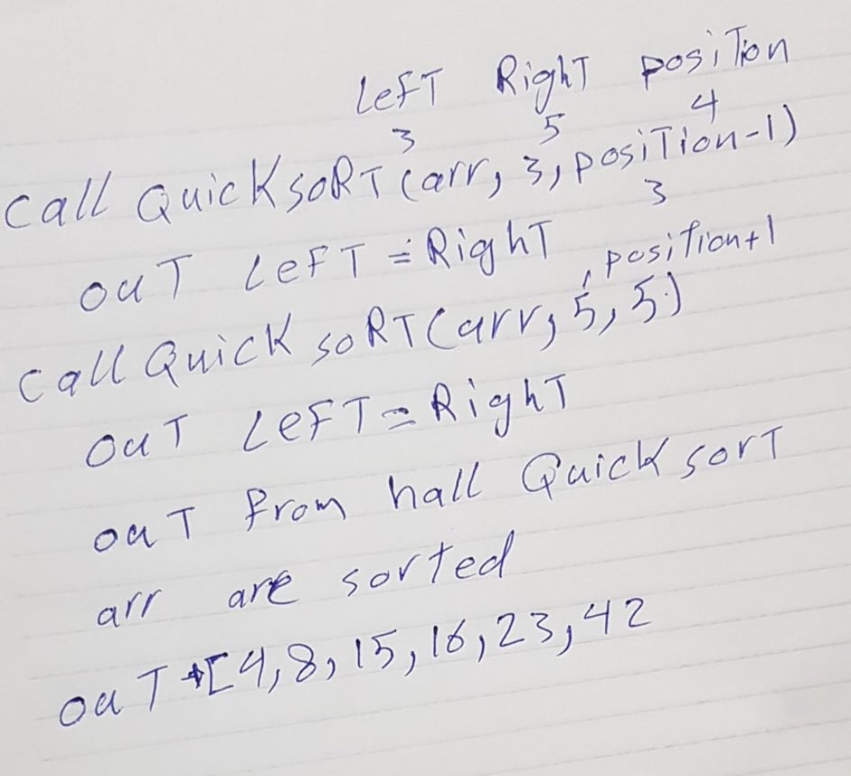
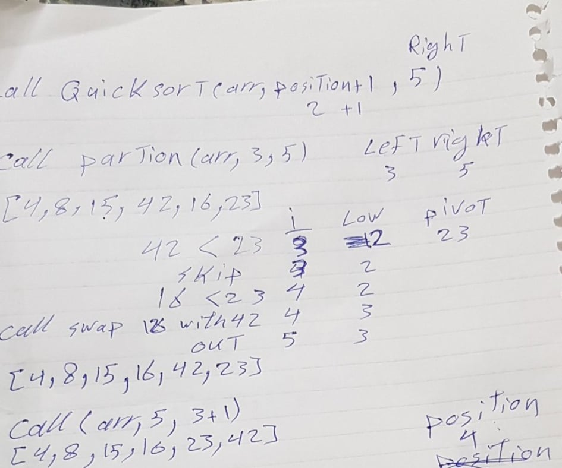

# Challenge Summary

trace the algorithm by stepping through the process with the provided sample array. Document your explanation by creating a blog article that shows the step-by-step output after each iteration through some sort of visual.

## Challenge Description

function that sort the input array quick sort

## Approach & Efficiency

trace the algorithm by stepping through the process with the provided sample array.
show that i am understanding how the process goes in the function

  
  here we got the most right element so specify it as pivot then we start sort the element by compare it by pivot if the number is  smaller swipe it with pre define index counter that index to the least smaller element index and if we sort less than pivot element that counter will increase
    
    after the first partion done the position will point to pivot element that moved after less element in array after that we will sort the left part to previous pivot by same the same algorithm  the sequence will end wen the element space become 1 after that we will go to right element to pivot and do the same till we finish 
     
