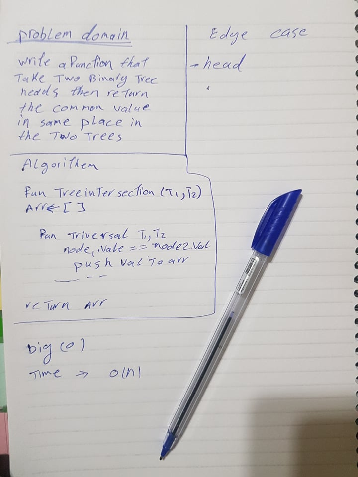

# Challenge Summary

 function called tree_intersection that takes two binary tree parameters.
 return a set of values found in both trees.

## Challenge Description

Write a function called tree_intersection that takes two binary tree parameters.
 return a set of values found in both trees.

## Approach & Efficiency

use traversal to go throw tree and if any node from the left and right have same value push it to declared arr

when the traversal done push the array 

## Solution

